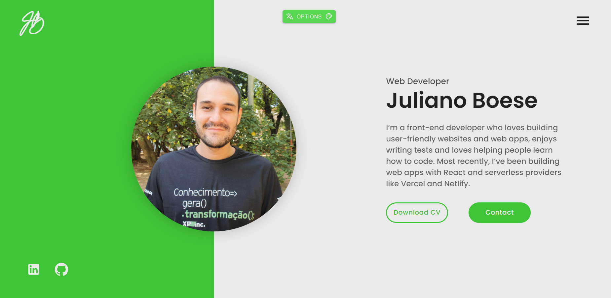
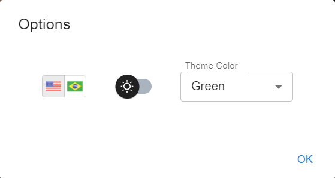

# Meu Portfólio <!-- no toc -->

  

  

## Table of Contents :scroll: <!-- no toc -->
- [Seções :bookmark:](#seções-bookmark)
- [Configurações :art:](#configurações-art)
- [Bibliotecas Utilizadas :package:](#bibliotecas-utilizadas-package)
- [APIs Utilizadas :world_map:](#apis-utilizadas-world_map)
- [Fontes e Imagens :performing_arts:](#fontes-e-imagens-performing_arts)
  - [Ilustrações](#ilustrações)
  - [Ícones](#ícones)
  - [Fontes](#fontes)
- [Contributors :man_technologist::woman_technologist:](#contributors-man_technologistwoman_technologist)

 

# Seções :bookmark:
- HOME
- ABOUT
- SKILLS
- PROJECTS 
- RESUME
    - EDUCATION
    - EXPERIENCE
- CONTACTS 

 

# Configurações :art:

  

 

# Bibliotecas Utilizadas :package:
- @emotion/react
- @emotion/styled
- @mui/material
- @mui/icons-material
- axios
- react-fast-marquee
- react-helmet
- react-reveal
- slick-carousel
- validator

 

# APIs Utilizadas :world_map:
- [SheetDB](https://sheetdb.io/)

 

# Fontes e Imagens :performing_arts:
## Ilustrações
- [Icons8](https://icons8.com/illustrations/styles)
- [SVG Porn](https://svgporn.com/)
- [Devicon](https://devicon.dev)

## Ícones
- [Material Icons](https://material-ui.com/components/material-icons/)

## Fontes
- [Poppins](https://fonts.google.com/specimen/Poppins)
- [Montserrat](https://fonts.google.com/specimen/Montserrat)
- [Raleway](https://fonts.google.com/specimen/Raleway)
- [Big Shoulders Text](https://fonts.google.com/specimen/Big+Shoulders+Text)
- [Bestermind](https://www.dafont.com/bestermind.font)
- [Roboto](https://fonts.google.com/specimen/Roboto)

 

# Contributors :man_technologist::woman_technologist:

    <table>
        <tr>
            <td align="center"><a href="https://github.com/julianoboese"> <b>Juliano Boese</b></a></td>
            <td align="center"><a href="https://github.com/hhhrrrttt222111"> <b>Hemanth R</b></a></td>
            <td align="center"><a href="https://github.com/ShimilSAbraham"> <b>Shimil S Abraham</b></a></td>
            <td align="center"><a href="https://github.com/Gayathry17"> <b>Gayathry S</b></a></td>
        </tr>
    </table>

